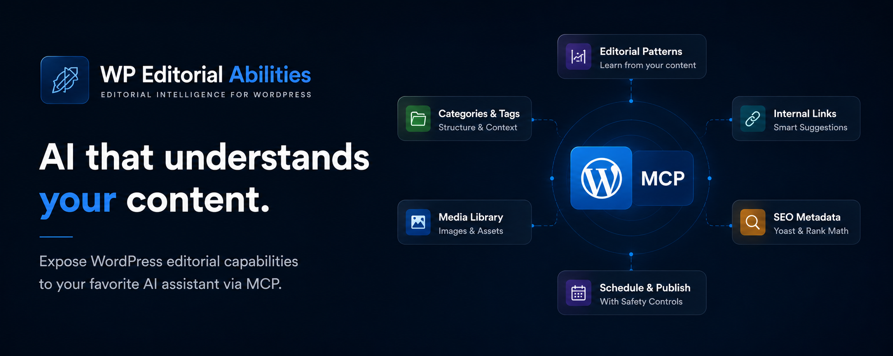
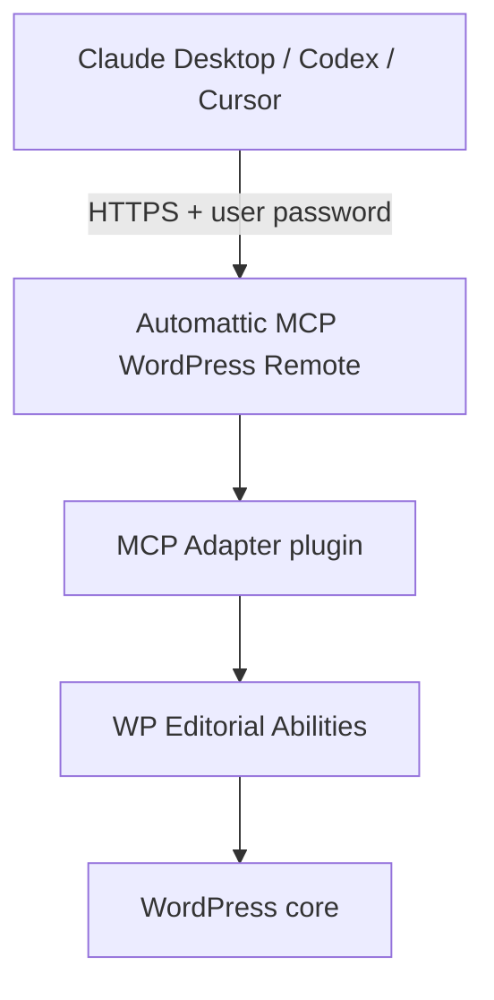

# WP Editorial Abilities

## What is this?

WordPress plugin that registers editorial workflow abilities — drafts, media, SEO, scheduling, publishing — through the [WordPress Abilities API](https://make.wordpress.org/core/2025/11/10/abilities-api/) and the official [MCP Adapter](https://github.com/WordPress/mcp-adapter).

## Why?

WordPress 7 introduces AI-powered workflows through the Abilities API and assistant integrations, making it easier than ever to generate and edit content directly from the editor.

However, generating content is only part of the editorial process.

Most AI assistants can write text, but they do not automatically understand:

- How your site structures articles
- Which editorial patterns are commonly used
- What content already exists
- Which internal links should be added
- How SEO metadata is managed
- How drafts move through your publishing workflow

WP Editorial Abilities extends the WordPress Abilities API with a set of editorial capabilities designed to give AI assistants access to that context.

Instead of generating content in isolation, agents can:

- Analyze existing content and category patterns
- Discover authors, categories, tags, and media assets
- Suggest internal links
- Manage SEO metadata
- Create, update, schedule, and publish drafts

Combined with the official MCP Adapter, these abilities become available to MCP-compatible assistants such as Claude Desktop, Codex, and Cursor.

The goal is not simply to help AI write content, but to help AI understand how content is created and managed on your WordPress site.

## How it works



See [`docs/ABILITIES.md`](docs/ABILITIES.md) for the full list of registered abilities.

## Requirements

- WordPress **6.9+** (tested against 7.0 stable).
- PHP **8.0+**.
- Site served over **HTTPS** (required for user password authentication).
- Official [`wordpress/mcp-adapter`](https://github.com/WordPress/mcp-adapter) plugin installed and active.
- An MCP client: Claude Desktop, Codex, or Cursor.
- Node.js LTS (runs the Automattic MCP remote bridge via `npx`).

## Installation

Estimated time: 20–30 minutes. All WordPress steps are done in wp-admin — no server SSH required.

If your host provides staging, complete the setup there first.

### 1. Download and activate plugins

**MCP Adapter** (install first):

1. Download the latest zip from [WordPress/mcp-adapter releases](https://github.com/WordPress/mcp-adapter/releases/latest).
2. In wp-admin: **Plugins → Add New → Upload Plugin** → install and activate.

**WP Editorial Abilities**:

1. Download the latest zip from [GitHub Releases](https://github.com/BlackBoxVision/wp-editorial-abilities/releases) (`wp-editorial-abilities-vX.Y.Z.zip`).
2. In wp-admin: **Plugins → Add New → Upload Plugin** → install and activate.

**Post-activation checks** on the Plugins screen:

- No notice — ready.
- Red notice ("requires WordPress 6.9…") — update WordPress first.
- Yellow notice ("install the MCP Adapter…") — activate MCP Adapter, then deactivate and reactivate this plugin.

### 2. Create an MCP user

Do not use your administrator account for MCP access.

1. **Users → Add New** — create a user such as `claude-editorial` with the **Editor** role (use **Author** if you want drafts only, without publish permission).
2. Set a strong password for that user and copy it immediately.

Save these values:

| Setting | Example |
| --- | --- |
| Site URL | `https://your-site.com` |
| Username | `your-wp-username` |
| User password | `your-wp-user-password` |

### 3. Connect your MCP client

Install [Node.js LTS](https://nodejs.org) if you do not have it. The bridge runs via `npx`.

#### Claude Desktop

1. Open **Settings → Developer → Edit Config** (`claude_desktop_config.json`).
2. Add or merge:

```json
{
  "mcpServers": {
    "wp-editorial": {
      "command": "npx",
      "args": ["-y", "@automattic/mcp-wordpress-remote@latest"],
      "env": {
        "WP_API_URL": "https://your-site.com/wp-json/mcp/mcp-adapter-default-server",
        "WP_API_USERNAME": "your-wp-username",
        "WP_API_PASSWORD": "your-wp-user-password"
      }
    }
  }
}
```

3. Replace `WP_API_URL`, `WP_API_USERNAME`, and `WP_API_PASSWORD` with your values. The URL must use `https://`.
4. Quit Claude Desktop completely and reopen it. The **wp-editorial** connector should appear.

#### Codex or Cursor

Add the same MCP server definition to your client's MCP configuration — `npx` with `@automattic/mcp-wordpress-remote@latest` and the same three environment variables (`WP_API_URL`, `WP_API_USERNAME`, `WP_API_PASSWORD`).

Restart the client after saving the config.

### 4. Verify the setup

Run these prompts in a new conversation and confirm results in wp-admin under **Posts**:

1. **"List the categories on my WordPress site."** — confirms the connection.
2. **"Create a draft titled *Installation test* with two short paragraphs."** — confirm a **Draft** appears.
3. **"Add SEO metadata to that post."** — check Yoast or Rank Math if active.
4. **"Publish it."** — Claude must ask for explicit confirmation; publishing requires your approval.

## Security

- Use a dedicated MCP user with editorial permissions only — not an administrator.
- Publish and schedule abilities require explicit confirmation (`confirm_publish: true`).
- Revoke access anytime: **Users → [MCP user] → reset or delete the user**.
- Review drafts in wp-admin before publishing.

## Troubleshooting

| Symptom | Likely cause | Fix |
| --- | --- | --- |
| Red notice: "requires WordPress 6.9…" | WordPress too old | Update WordPress |
| Yellow notice: "install the MCP Adapter…" | MCP Adapter missing | Install and activate MCP Adapter first |
| MCP connector missing | Invalid JSON or client not restarted | Validate config JSON; fully quit and reopen the client |
| 401 / unauthorized | Wrong password or HTTP URL | Check user password; use `https://` |
| 500 / `incorrect_password` — `Connection Failed`, tools never load | Application Password used instead of user password | Replace `WP_API_PASSWORD` with the user's actual login password, not a WordPress Application Password |
| `command not found: npx` | Node.js not installed | Install Node.js LTS and restart |
| Categories work, drafts fail | Insufficient permissions | Use **Editor** role for the MCP user |
| SEO not saved | No SEO plugin | Activate Yoast SEO or Rank Math |
| Connector shows "Connection Failed" but appears connected; tools never load; `404` in the logs | `WP_API_URL` points to a **headless front-end**, not to WordPress | Point `WP_API_URL` to the real WordPress backend — see [Headless WordPress: pointing at the wrong domain](#headless-wordpress-pointing-at-the-wrong-domain) |

### Headless WordPress: pointing at the wrong domain

On a headless setup, the public domain serves a separate front-end (Next.js, Astro, etc.) and WordPress lives on a different host (commonly a `wp.` subdomain). If `WP_API_URL` points at the **front-end**, `/wp-json/` does not exist there, so the front-end returns **its own 404** — not a WordPress REST error.

The Automattic bridge still starts the local session (so the connector looks "connected", often with `serverInfo: "Connection Failed"`), but the upstream `tools/list` fails with `404` and no tools ever load. It never reached WordPress.

**How to recognize it:** open the MCP log (see [Where the logs live](#where-the-logs-live)) and look at the body of the 404. If it contains `__NEXT_DATA__`, `/_error`, MUI markup, or `<link rel="preconnect" href="https://wp.yoursite.com">`, you are hitting the headless front-end, not WordPress.

**Fix:** set `WP_API_URL` to the real backend, then fully restart the client:

```json
"WP_API_URL": "https://wp.yoursite.com/wp-json/mcp/mcp-adapter-default-server"
```

**Confirm the backend before restarting** (replace the host with your own):

```bash
# Should return WordPress REST JSON (name, namespaces, …), HTTP 200
curl -s -o /dev/null -w "%{http_code}\n" "https://wp.yoursite.com/wp-json/"

# The MCP endpoint, unauthenticated:
#   401 rest_forbidden  → route exists, MCP Adapter is active (good — auth gate)
#   404 rest_no_route   → MCP Adapter / this plugin not active on that instance
curl -s "https://wp.yoursite.com/wp-json/mcp/mcp-adapter-default-server"
```

If, after fixing the domain, you still get a `404` — but now a *WordPress* `rest_no_route` 404 instead of the front-end's — the problem shifts to the plugins not being active on that WordPress instance.

### Where the logs live

Claude Desktop writes MCP logs to:

- **macOS:** `~/Library/Logs/Claude/`
- **Windows:** `%APPDATA%\Claude\logs\`

The most useful files for this connector:

- `mcp-server-wp-editorial.log` — the bridge for the `wp-editorial` server (filename follows the server key in your config; rename accordingly if you used a different key).
- `mcp.log` — general MCP client log across all servers.

Quick tail on macOS:

```bash
tail -f ~/Library/Logs/Claude/mcp-server-wp-editorial.log
```

## Further reading

- [`docs/ABILITIES.md`](docs/ABILITIES.md) — full abilities reference and SEO options
- [`docs/REPOSITORY-ANATOMY.md`](docs/REPOSITORY-ANATOMY.md) — architecture and codebase layout
- [`CONTRIBUTING.md`](CONTRIBUTING.md) — local development, testing, and releases
