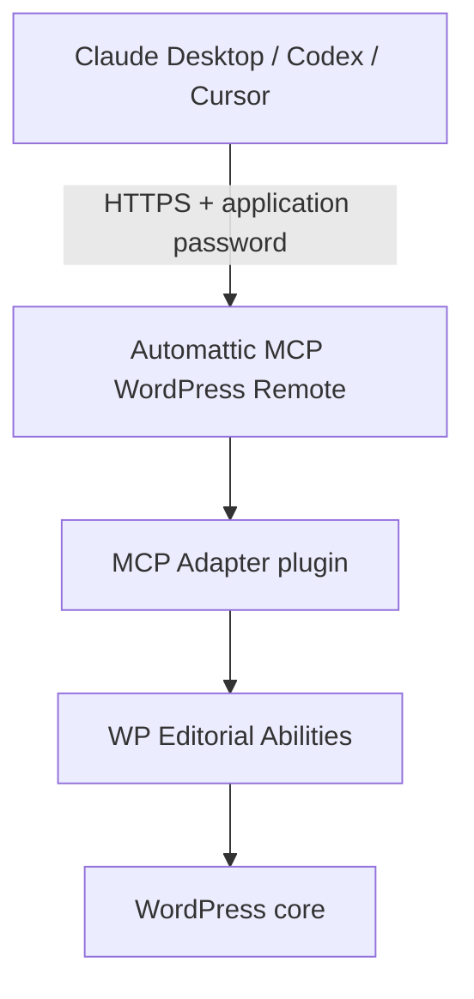

# WP Editorial Abilities

## What is this?

WordPress plugin that registers editorial workflow abilities — drafts, media, SEO, scheduling, publishing — through the [WordPress Abilities API](https://make.wordpress.org/core/2025/11/10/abilities-api/) and the official [MCP Adapter](https://github.com/WordPress/mcp-adapter).

## Why?

WordPress 7 ships AI assistants inside the editor, but that integration expects **provider API keys** (OpenAI, Anthropic, etc.) billed per token — separate from the flat **$20/month subscriptions** many people already pay for Claude or ChatGPT.

This plugin offers an alternative:

- **[MCP Adapter](https://github.com/WordPress/mcp-adapter)** exposes WordPress abilities over MCP.
- **WP Editorial Abilities** (this repo) registers the editorial tools an AI assistant needs.
- **[Automattic MCP WordPress Remote](https://www.npmjs.com/package/@automattic/mcp-wordpress-remote)** connects your local MCP client to your WordPress site over HTTPS and an application password.

Use your existing **Claude Desktop**, **Codex**, or **Cursor** subscription. No extra AI API key is required on the WordPress side.

## How it works



See [`docs/ABILITIES.md`](docs/ABILITIES.md) for the full list of registered abilities.

## Requirements

- WordPress **6.9+** (tested against 7.0 stable).
- PHP **8.0+**.
- Site served over **HTTPS** (required for application password authentication).
- Official [`wordpress/mcp-adapter`](https://github.com/WordPress/mcp-adapter) plugin installed and active.
- An MCP client: Claude Desktop, Codex, or Cursor.
- Node.js LTS (runs the Automattic MCP remote bridge via `npx`).

## Installation

Estimated time: 20–30 minutes. All WordPress steps are done in wp-admin — no server SSH required.

If your host provides staging, complete the setup there first.

### 1. Download and activate plugins

**MCP Adapter** (install first):

1. Download the latest zip from [WordPress/mcp-adapter releases](https://github.com/WordPress/mcp-adapter/releases/latest).
2. In wp-admin: **Plugins → Add New → Upload Plugin** → install and activate.

**WP Editorial Abilities**:

1. Download the latest zip from [GitHub Releases](https://github.com/BlackBoxVision/wp-editorial-abilities/releases) (`wp-editorial-abilities-vX.Y.Z.zip`).
2. In wp-admin: **Plugins → Add New → Upload Plugin** → install and activate.

**Post-activation checks** on the Plugins screen:

- No notice — ready.
- Red notice ("requires WordPress 6.9…") — update WordPress first.
- Yellow notice ("install the MCP Adapter…") — activate MCP Adapter, then deactivate and reactivate this plugin.

### 2. Create an MCP user and application password

Do not use your administrator account for MCP access.

1. **Users → Add New** — create a user such as `claude-editorial` with the **Editor** role (use **Author** if you want drafts only, without publish permission).
2. Open that user's profile → **Application Passwords** → create one named e.g. `MCP Client` → copy the password immediately.

Save these values:

| Setting | Example |
| --- | --- |
| Site URL | `https://yoursite.com` |
| Username | `claude-editorial` |
| Application password | `abcd EFGH 1234 wxyz 5678 90ab` |

### 3. Connect your MCP client

Install [Node.js LTS](https://nodejs.org) if you do not have it. The bridge runs via `npx`.

#### Claude Desktop

1. Open **Settings → Developer → Edit Config** (`claude_desktop_config.json`).
2. Add or merge:

```json
{
  "mcpServers": {
    "wp-editorial": {
      "command": "npx",
      "args": ["-y", "@automattic/mcp-wordpress-remote@latest"],
      "env": {
        "WP_API_URL": "https://yoursite.com/wp-json/mcp/mcp-adapter-default-server",
        "WP_API_USERNAME": "claude-editorial",
        "WP_API_PASSWORD": "abcd EFGH 1234 wxyz 5678 90ab"
      }
    }
  }
}
```

3. Replace `WP_API_URL`, `WP_API_USERNAME`, and `WP_API_PASSWORD` with your values. The URL must use `https://`.
4. Quit Claude Desktop completely and reopen it. The **wp-editorial** connector should appear.

#### Codex or Cursor

Add the same MCP server definition to your client's MCP configuration — `npx` with `@automattic/mcp-wordpress-remote@latest` and the same three environment variables (`WP_API_URL`, `WP_API_USERNAME`, `WP_API_PASSWORD`).

Restart the client after saving the config.

### 4. Verify the setup

Run these prompts in a new conversation and confirm results in wp-admin under **Posts**:

1. **"List the categories on my WordPress site."** — confirms the connection.
2. **"Create a draft titled *Installation test* with two short paragraphs."** — confirm a **Draft** appears.
3. **"Add SEO metadata to that post."** — check Yoast or Rank Math if active.
4. **"Publish it."** — Claude must ask for explicit confirmation; publishing requires your approval.

## Security

- Use a dedicated MCP user with editorial permissions only — not an administrator.
- Publish and schedule abilities require explicit confirmation (`confirm_publish: true`).
- Revoke access anytime: **Users → [MCP user] → Application Passwords → Revoke**.
- Review drafts in wp-admin before publishing.

## Troubleshooting

| Symptom | Likely cause | Fix |
| --- | --- | --- |
| Red notice: "requires WordPress 6.9…" | WordPress too old | Update WordPress |
| Yellow notice: "install the MCP Adapter…" | MCP Adapter missing | Install and activate MCP Adapter first |
| MCP connector missing | Invalid JSON or client not restarted | Validate config JSON; fully quit and reopen the client |
| 401 / unauthorized | Wrong password or HTTP URL | Regenerate application password; use `https://` |
| `command not found: npx` | Node.js not installed | Install Node.js LTS and restart |
| Categories work, drafts fail | Insufficient permissions | Use **Editor** role for the MCP user |
| SEO not saved | No SEO plugin | Activate Yoast SEO or Rank Math |

## Further reading

- [`docs/ABILITIES.md`](docs/ABILITIES.md) — full abilities reference and SEO options
- [`docs/REPOSITORY-ANATOMY.md`](docs/REPOSITORY-ANATOMY.md) — architecture and codebase layout
- [`CONTRIBUTING.md`](CONTRIBUTING.md) — local development, testing, and releases
